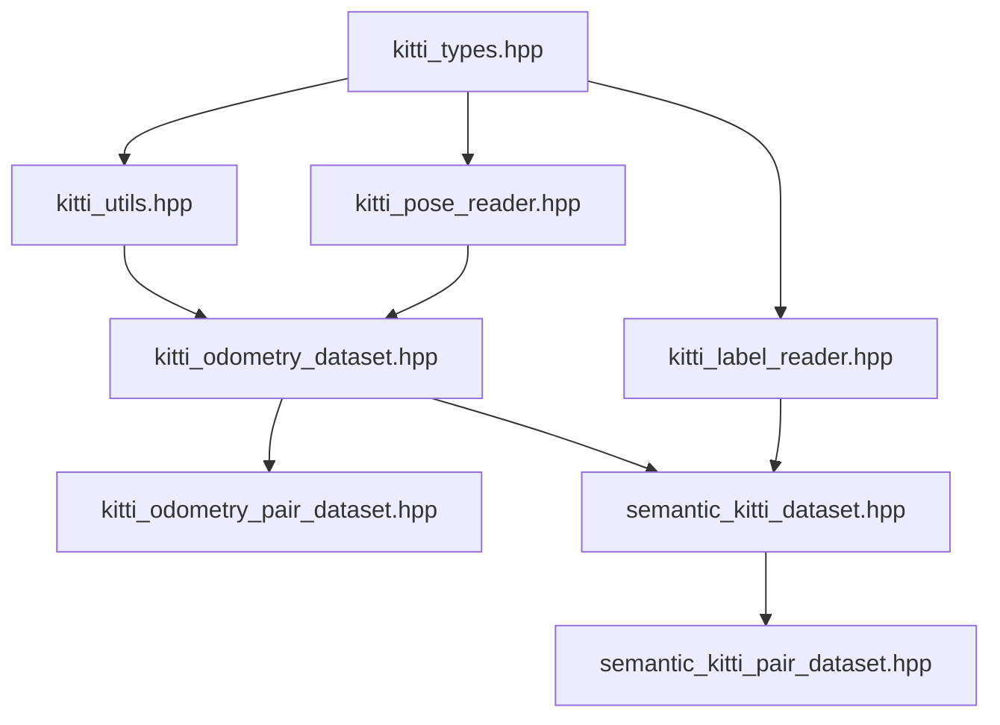

# KITTI Dataset Loader 实施计划表

## 项目概述
- **项目名称**: KITTI Odometry Dataset Loader for cpp-toolbox
- **预计工期**: 10个工作日
- **主要目标**: 实现完整的KITTI和Semantic KITTI数据集加载器

## 详细实施计划

### Phase 1: 基础设施建设（2天）

#### Day 1: 数据结构和类型定义
| 任务 | 文件 | 描述 | 优先级 |
|------|------|------|--------|
| 创建数据结构头文件 | `kitti_types.hpp` | 定义所有KITTI相关数据结构 | 高 |
| 创建工具函数头文件 | `kitti_utils.hpp` | 声明所有工具函数 | 高 |
| 实现基础工具函数 | `kitti_utils_impl.hpp` | 实现点云读写、路径处理等 | 高 |
| 创建异常类 | `kitti_exceptions.hpp` | 定义KITTI特定异常类型 | 中 |

#### Day 2: 辅助组件实现
| 任务 | 文件 | 描述 | 优先级 |
|------|------|------|--------|
| 实现pose reader | `kitti_pose_reader.hpp/impl` | 读取和解析poses.txt | 高 |
| 实现label reader | `kitti_label_reader.hpp/impl` | 读取.label文件 | 高 |
| 实现calibration | `kitti_calibration.hpp/impl` | 读取标定信息 | 中 |
| 单元测试 | `test/kitti_utils_test.cpp` | 测试辅助组件 | 高 |

### Phase 2: 核心数据集实现（3天）

#### Day 3: 基础KITTI数据集
| 任务 | 文件 | 描述 | 优先级 |
|------|------|------|--------|
| 实现dataset类 | `kitti_odometry_dataset.hpp` | 基础数据集类声明 | 高 |
| 实现核心功能 | `impl/kitti_odometry_dataset_impl.hpp` | size_impl, at_impl等 | 高 |
| 实现缓存机制 | 同上 | LRU缓存实现 | 高 |
| 错误处理 | 同上 | 异常处理和验证 | 高 |

#### Day 4: 点云对数据集
| 任务 | 文件 | 描述 | 优先级 |
|------|------|------|--------|
| 实现pair dataset | `kitti_odometry_pair_dataset.hpp` | 点云对数据集 | 高 |
| 相对变换计算 | `impl/kitti_odometry_pair_dataset_impl.hpp` | 实现相对pose计算 | 高 |
| Skip参数支持 | 同上 | 可配置的帧间隔 | 高 |
| 单元测试 | `test/kitti_dataset_test.cpp` | 测试基础功能 | 高 |

#### Day 5: 整合和优化
| 任务 | 文件 | 描述 | 优先级 |
|------|------|------|--------|
| 性能优化 | - | 优化文件读取和缓存 | 中 |
| 集成测试 | `test/kitti_integration_test.cpp` | 与dataloader集成测试 | 高 |
| 调试修复 | - | 修复发现的问题 | 高 |
| 代码审查 | - | 代码质量检查 | 中 |

### Phase 3: Semantic KITTI支持（2天）

#### Day 6: Semantic数据集
| 任务 | 文件 | 描述 | 优先级 |
|------|------|------|--------|
| 实现semantic dataset | `semantic_kitti_dataset.hpp` | 语义数据集类 | 高 |
| 标签处理功能 | `impl/semantic_kitti_dataset_impl.hpp` | 标签读取和查询 | 高 |
| 语义过滤功能 | 同上 | get_labeled_cloud等 | 高 |
| 标签统计功能 | 同上 | 统计各类别点数 | 中 |

#### Day 7: Semantic点云对
| 任务 | 文件 | 描述 | 优先级 |
|------|------|------|--------|
| 实现pair dataset | `semantic_kitti_pair_dataset.hpp` | 语义点云对 | 高 |
| 实现核心功能 | `impl/semantic_kitti_pair_dataset_impl.hpp` | 完整实现 | 高 |
| 单元测试 | `test/semantic_kitti_test.cpp` | 测试语义功能 | 高 |
| 性能测试 | `benchmark/kitti_loader_bench.cpp` | 基准测试 | 中 |

### Phase 4: 测试和优化（2天）

#### Day 8: 全面测试
| 任务 | 文件 | 描述 | 优先级 |
|------|------|------|--------|
| 单元测试完善 | `test/kitti_*_test.cpp` | 覆盖所有功能 | 高 |
| 边界测试 | 同上 | 测试异常情况 | 高 |
| 性能基准测试 | `benchmark/kitti_benchmark.cpp` | 性能评估 | 中 |
| 内存泄漏检查 | - | valgrind测试 | 高 |

#### Day 9: 优化和修复
| 任务 | 描述 | 优先级 |
|------|------|--------|
| 性能优化 | 基于测试结果优化 | 高 |
| Bug修复 | 修复测试发现的问题 | 高 |
| 代码重构 | 改进代码质量 | 中 |
| 兼容性测试 | 不同平台测试 | 中 |

### Phase 5: 文档和示例（1天）

#### Day 10: 文档完善
| 任务 | 文件 | 描述 | 优先级 |
|------|------|------|--------|
| API文档 | `docs/kitti_api.md` | 详细API说明 | 高 |
| 使用指南 | `docs/kitti_guide.md` | 用户指南 | 高 |
| 示例程序 | `example/kitti_*.cpp` | 各种使用示例 | 高 |
| README更新 | `README.md` | 添加KITTI部分 | 中 |

## 文件结构规划

```
src/include/cpp-toolbox/io/
├── dataloader/
│   ├── kitti_odometry_dataset.hpp
│   ├── kitti_odometry_pair_dataset.hpp
│   ├── semantic_kitti_dataset.hpp
│   ├── semantic_kitti_pair_dataset.hpp
│   └── impl/
│       ├── kitti_odometry_dataset_impl.hpp
│       ├── kitti_odometry_pair_dataset_impl.hpp
│       ├── semantic_kitti_dataset_impl.hpp
│       └── semantic_kitti_pair_dataset_impl.hpp
├── dataset/
│   ├── kitti_types.hpp
│   ├── kitti_utils.hpp
│   ├── kitti_pose_reader.hpp
│   ├── kitti_label_reader.hpp
│   ├── kitti_calibration.hpp
│   ├── kitti_exceptions.hpp
│   └── impl/
│       ├── kitti_utils_impl.hpp
│       ├── kitti_pose_reader_impl.hpp
│       ├── kitti_label_reader_impl.hpp
│       └── kitti_calibration_impl.hpp
```

## 依赖关系



## 测试覆盖计划

| 测试类型 | 覆盖内容 | 目标覆盖率 |
|---------|---------|------------|
| 单元测试 | 所有公共方法 | >90% |
| 集成测试 | 数据集加载流程 | >80% |
| 性能测试 | 加载速度、内存使用 | - |
| 异常测试 | 错误处理路径 | >85% |

## 风险评估和缓解措施

| 风险 | 影响 | 概率 | 缓解措施 |
|------|------|------|----------|
| KITTI格式变化 | 高 | 低 | 版本兼容性设计 |
| 大数据集性能问题 | 中 | 中 | 缓存和预取优化 |
| 内存使用过高 | 中 | 中 | 可配置缓存大小 |
| 跨平台兼容性 | 低 | 低 | 充分测试 |

## 里程碑和交付物

| 里程碑 | 日期 | 交付物 |
|--------|------|--------|
| M1: 基础设施完成 | Day 2 | 辅助组件和工具函数 |
| M2: 核心功能完成 | Day 5 | KITTI基础数据集 |
| M3: 全功能完成 | Day 7 | Semantic KITTI支持 |
| M4: 测试完成 | Day 9 | 所有测试通过 |
| M5: 项目完成 | Day 10 | 完整文档和示例 |

## 成功标准

1. **功能完整性**
   - ✓ 支持所有需求的数据集类型
   - ✓ 完整的错误处理
   - ✓ 与现有架构良好集成

2. **性能指标**
   - ✓ 单帧加载时间 < 10ms
   - ✓ 内存使用可控
   - ✓ 支持大规模数据集

3. **代码质量**
   - ✓ 测试覆盖率 > 85%
   - ✓ 文档完整
   - ✓ 符合编码规范

4. **可用性**
   - ✓ 清晰的API设计
   - ✓ 丰富的示例代码
   - ✓ 详细的使用文档